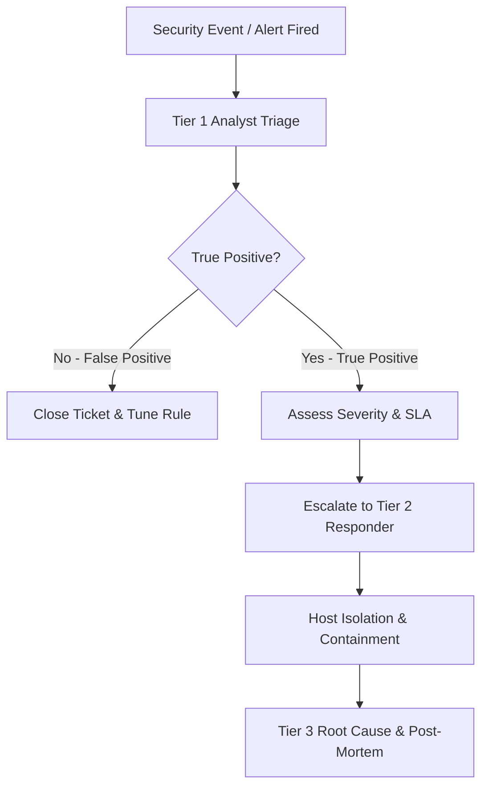
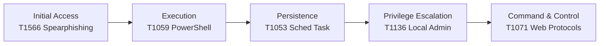
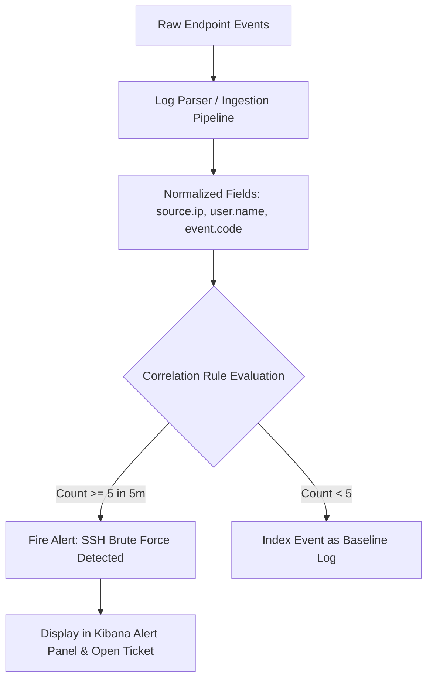
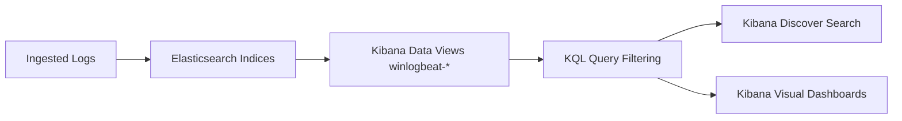
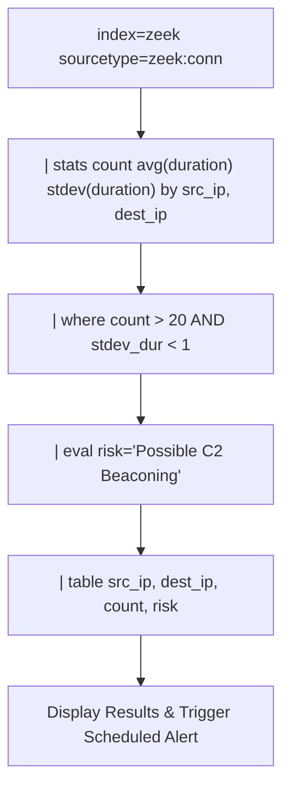
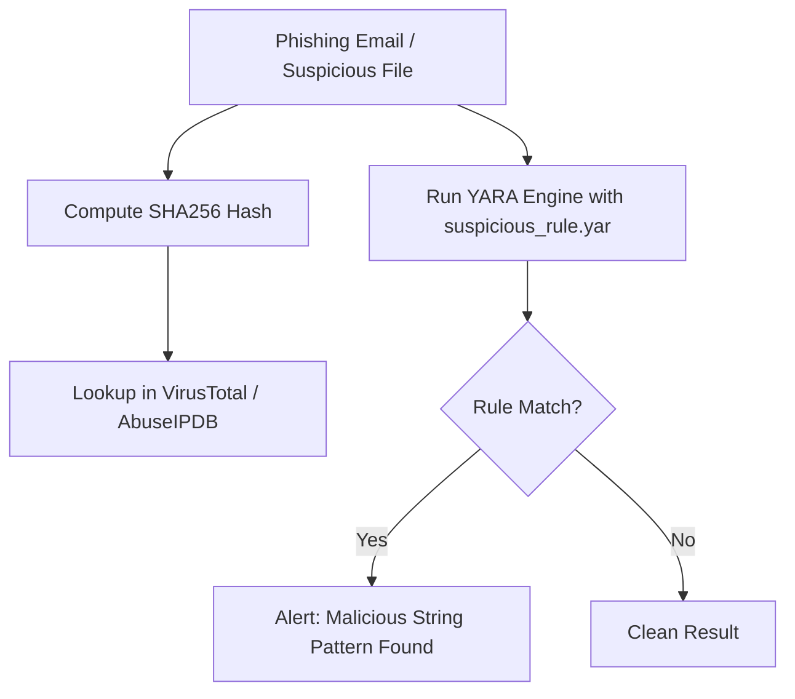
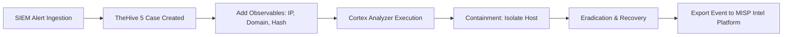
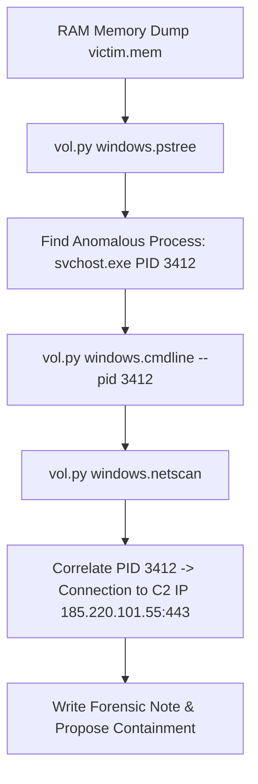
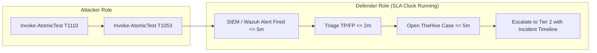

# SD0601 — SOC Analyst: Security Monitoring and Incident Response
## Comprehensive Master Presentation Deck & Curriculum Slides (Days 1–5)

**Duration:** 5 Days / 60 Hours  
**Audience:** Aspiring L1/L2 SOC Analysts & Security Engineers  
**Editable Presentation Files (.pptx):**
- [Day 1 Deck — SOC Fundamentals & ATT&CK](file:///home/dev/Templates/SD0601-SOC-Analyst-Workshop/slides/SD0601_Day1_SOC_Fundamentals.pptx)
- [Day 2 Deck — Security Monitoring & Log Management](file:///home/dev/Templates/SD0601-SOC-Analyst-Workshop/slides/SD0601_Day2_Log_Management.pptx)
- [Day 3 Deck — SIEM & Log Analysis (Splunk & ELK)](file:///home/dev/Templates/SD0601-SOC-Analyst-Workshop/slides/SD0601_Day3_SIEM_Splunk_ELK.pptx)
- [Day 4 Deck — Threat Detection & Incident Response](file:///home/dev/Templates/SD0601-SOC-Analyst-Workshop/slides/SD0601_Day4_Threat_Detection_IR.pptx)
- [Day 5 Deck — Endpoint Hunting, Forensics & Live Drill](file:///home/dev/Templates/SD0601-SOC-Analyst-Workshop/slides/SD0601_Day5_Endpoint_Forensics_LiveDrill.pptx)
- [Master Presentation Deck (All Days Combined)](file:///home/dev/Templates/SD0601-SOC-Analyst-Workshop/slides/SD0601_Master_Presentation_Deck.pptx)

---

## 🗓️ DAY 1: MODULE 1 — SOC FUNDAMENTALS & ATT&CK TAXONOMY

### Slide 1.1: SOC Roles, Responsibilities & Blue Team Concepts
**TOC Topics Covered:** SOC Fundamentals, Roles & Responsibilities in SOC, Blue Team Concepts, Security Policies & Procedures.

#### 📚 Core Fundamentals & Concepts
- **Definition of Security Operations Center (SOC):** A centralized command center monitoring, detecting, analyzing, and responding to cybersecurity incidents 24/7/365.
- **SOC Tier Roles & Responsibilities:**
  - **Tier 1 (SOC Analyst):** Monitors security dashboards, triages incoming alerts, performs initial true/false positive verification, and enforces SLAs (5–10 min response time).
  - **Tier 2 (Incident Responder):** Performs deep-dive log analysis, containment (host isolation), eradication, and scope determination.
  - **Tier 3 (Threat Hunter / Forensic Specialist):** Performs proactive hypothesis-driven hunting, malware string analysis, and memory triage.
  - **SOC Lead / Manager:** Overseas operational readiness, shift handovers, escalation metrics, and compliance reporting.
- **Blue Team vs Red Team Dynamics:** Red Team simulates adversary tactics; Blue Team defends, detects, and triages; Purple Team collaborates to refine detection rules.

#### 💡 How to Explain to Students
- **Hospital ER Analogy:** Explain that Tier 1 is like the Emergency Room Triage Nurse (rapid decision: critical vs minor), Tier 2 is the ER Doctor (treat and stabilize), and Tier 3 is the Specialist Surgeon.
- **Key Operational Metrics:** Teach students the importance of **MTTD** (Mean Time to Detect) and **MTTR** (Mean Time to Respond).

#### 🔬 Lab 1.1 Connection & Flowchart
- **Lab 1.1:** Triage 8 realistic SOC tickets, classify severity, apply escalation rules, and determine incident priority.



---

### Slide 1.2: Cyber Threat Landscape & MITRE ATT&CK Framework
**TOC Topics Covered:** Cyber Threat Landscape, Security Monitoring Basics, Security Policies, MITRE ATT&CK Taxonomy.

#### 📚 Core Fundamentals & Concepts
- **Cyber Threat Landscape:** Phishing, Ransomware droppers, Supply Chain compromises, Insider threats, and C2 beaconing.
- **MITRE ATT&CK Framework:** A globally accessible knowledge base of adversary tactics and techniques based on real-world observations.
- **Tactics vs. Techniques:**
  - **Tactics (The "Why"):** 14 enterprise tactics representing the adversary's operational goal (e.g., Initial Access, Execution, Persistence, Privilege Escalation).
  - **Techniques (The "How"):** Specific technical methods used to achieve a tactic (e.g., `T1566.001 Spearphishing Attachment`, `T1059.001 PowerShell`).
- **ATT&CK Navigator:** An interactive visual grid mapping an organization's defensive detection coverage against known adversary techniques.

#### 💡 How to Explain to Students
- Use an attack chain example: An attacker sends a phishing email (`T1566`), tricks the user into opening a macro (`T1204`), which launches PowerShell (`T1059`), creates a scheduled task for persistence (`T1053`), and adds a local admin user (`T1136`).
- Demonstrate how ATT&CK provides a standardized "common language" between security analysts, penetration testers, and management.

#### 🔬 Lab 1.1 Connection & Flowchart
- **Lab 1.1:** Map 7 simulated security incidents to ATT&CK Technique IDs and build an ATT&CK Navigator JSON layer.



---

## 🗓️ DAY 2: MODULE 2 — SECURITY MONITORING & LOG MANAGEMENT

### Slide 2.1: Log Sources, Telemetry & Collection Agents
**TOC Topics Covered:** Security Monitoring Concepts, Log Sources and Log Collection, Windows, Linux, and Application Logs.

#### 📚 Core Fundamentals & Concepts
- **Log Sources:** Endpoints (Windows/Linux), Network devices (Firewalls/Zeek), Security applications (AV/EDR), and Authentication services (Active Directory/SSH).
- **Windows Security Event Logs:**
  - `Event ID 4624`: Successful Logon
  - `Event ID 4625`: Failed Logon (Key fields: TargetUserName, IpAddress, Status/SubStatus)
  - `Event ID 4720`: Local User Account Created
  - `Event ID 4698`: Scheduled Task Created
- **Sysmon (System Monitor):** Advanced Windows host logging service. Key events: `Event ID 1` (Process Create with full command lines), `Event ID 3` (Network Connection), `Event ID 11` (File Create).
- **Linux Logging:** `/var/log/auth.log` (SSH attempts, `sudo` commands) and `auditd` (Linux kernel audit framework watching `/etc/passwd`).
- **Log Agents:** **Winlogbeat** (Windows event log collector) and **Filebeat** (Linux log file harvester) shipping JSON events to SIEM.

#### 💡 How to Explain to Students
- Explain why standard Windows logs are insufficient: Standard logs tell you `cmd.exe` launched, but Sysmon tells you `cmd.exe /c powershell.exe -EncodedCommand JABW...` (the full malicious command line).
- Show how log forwarders act as reliable couriers shipping raw endpoint logs into centralized SIEM storage.

#### 🔬 Lab 2.1 Connection & Flowchart
- **Lab 2.1:** Configure Sysmon with SwiftOnSecurity rules, Winlogbeat on Windows VM, Filebeat + auditd on Ubuntu VM, shipping to ELK.

```mermaid
flowchart TD
    subgraph WIN ["Windows VM"]
        SYS[Sysmon Driver] --> EVT[Win Event Channel]
        EVT --> WLOG[Winlogbeat Agent]
    end
    subgraph LIN ["Ubuntu VM"]
        AUD[auditd Watch Rules] --> LOGS[/var/log/auth.log]
        LOGS --> FBEAT[Filebeat Agent]
    end
    WLOG -->|Beats Protocol :5044 / HTTP :9200| ES[(Elasticsearch SIEM)]
    FBEAT -->|Beats Protocol :5044 / HTTP :9200| ES
    ES --> KIB[Kibana Discover UI]
```

---

### Slide 2.2: Log Parsing, Event Correlation & Alert Generation
**TOC Topics Covered:** Event Correlation, Log Parsing and Analysis, Alert Generation and Prioritization.

#### 📚 Core Fundamentals & Concepts
- **Log Parsing & Normalization:** Converting raw text logs into structured schema fields (e.g., mapping `src_ip`, `user`, `action` into Elastic Common Schema (ECS)).
- **Event Correlation Logic:** Combining multiple low-level events over time to detect multi-stage attack patterns.
- **Threshold-Based Correlation:**
  - Rule: 5 or more `Event ID 4625` (Failed Logins) from the same `source.ip` within 5 minutes = **Possible Brute Force Attack**.
- **Sequence-Based Correlation:**
  - Rule: `Event ID 4720` (Account Created) followed within 30 seconds by `Event ID 4732` (Added to Administrators Group) = **Privilege Escalation Alert**.
- **Alert Prioritization:** Rating alerts by Impact x Likelihood (Critical, High, Medium, Low) to prevent analyst burnout.

#### 💡 How to Explain to Students
- 1 failed login is a user typo; 50 failed logins in 60 seconds is a machine brute-force attack.
- Correlation rules transform millions of log noise lines into a manageable handful of high-confidence security alerts.

#### 🔬 Lab 2.1 Connection & Flowchart
- **Lab 2.1:** Build and test a 5-failed-login SSH brute-force correlation rule in Kibana.



---

## 🗓️ DAY 3: MODULE 3 — SIEM & LOG ANALYSIS (SPLUNK & ELK)

### Slide 3.1: SIEM Architecture & Kibana Searching (KQL)
**TOC Topics Covered:** SIEM Architecture, Event Collection, ELK Stack Fundamentals, Kibana Searching & Dashboard Creation.

#### 📚 Core Fundamentals & Concepts
- **SIEM Core Functions:** Aggregation, Normalization, Correlation, Retention, Search, Alerting, Dashboarding.
- **ELK Stack Components:**
  - **Elasticsearch:** Distributed JSON document search engine storing indices (`winlogbeat-*`, `filebeat-*`).
  - **Logstash:** Log ingestion engine for parsing and transforming complex logs.
  - **Kibana:** Web visualization and administration dashboard.
- **Kibana Query Language (KQL):** Filter-first query syntax for rapid searching in Kibana Discover.
  - Example 1: `event.code:4625 AND event.outcome:failure`
  - Example 2: `process.name:powershell.exe AND process.command_line:*-EncodedCommand*`
- **Dashboard Engineering:** Arranging visual panels (Time Series, Top Talkers Table, Metric Counts) for 24/7 SOC monitoring.

#### 💡 How to Explain to Students
- Compare a SIEM to a dedicated search engine built specifically for cybersecurity logs.
- Show students how KQL filters narrow millions of events down to the exact 3 events of interest in seconds.

#### 🔬 Lab 3.1 Connection & Flowchart
- **Lab 3.1:** Write 5 KQL detection queries, create Kibana Data Views, and build a 3-panel Failed Logins & Port Scans Dashboard.



---

### Slide 3.2: Splunk Architecture & SPL Search Engineering
**TOC Topics Covered:** Introduction to Splunk, Basic Search Queries (SPL), Reports, Dashboards & Alerts.

#### 3 Core Fundamentals & Concepts
- **Splunk Architecture:**
  - **Universal Forwarder:** Light agent collected logs from endpoints.
  - **Indexer:** Parses, indexes, and stores log data into indexes (`main`, `zeek`).
  - **Search Head:** Provides web UI for SPL query execution and dashboard visualization.
- **Splunk Processing Language (SPL):** Pipeline-based query syntax using pipes (`|`) to transform search data.
  - **Query 1 (Brute Force):** `index=main sourcetype="WinEventLog:Security" EventCode=4625 | stats count by src_ip, dest_user | where count > 5`
  - **Query 2 (Port Scan):** `index=zeek sourcetype="zeek:conn" | stats dc(dest_port) as unique_ports by src_ip | where unique_ports > 20`
  - **Query 3 (C2 Beaconing):** `index=zeek sourcetype="zeek:conn" | stats count avg(duration) as avg_dur stdev(duration) as stdev_dur by src_ip, dest_ip | where count > 20 AND stdev_dur < 1`
- **Splunk Alerting:** Saving search queries as real-time or scheduled alerts sending email/webhook notifications.

#### 💡 How to Explain to Students
- Differentiate KQL (filter-first) vs. SPL (pipeline transformation engine).
- Explain the beaconing formula: Machine beaconing has a very low standard deviation (`stdev < 1`) because automated malware contacts C2 at rigid, exact time intervals.

#### 🔬 Lab 3.1 Connection & Flowchart
- **Lab 3.1:** Write SPL queries for brute force, port scans, C2 beaconing, and configure a scheduled Splunk alert.



---

## 🗓️ DAY 4: MODULE 4 — THREAT DETECTION & INCIDENT RESPONSE

### Slide 4.1: Indicators of Compromise (IOC) & YARA Analysis
**TOC Topics Covered:** Indicators of Compromise (IOC), Malware Detection Basics, YARA Rule Matching.

#### 📚 Core Fundamentals & Concepts
- **Indicators of Compromise (IOCs):** Technical artifacts left by attackers during a breach (SHA256 hashes, malicious IPs, phishing domains, registry keys).
- **The Pyramid of Pain (Bianca Rivera):**
  - **Hashes (Bottom):** Trivial for attackers to change (1-bit change = new hash).
  - **IP Addresses / Domain Names:** Easy to swap or use dynamic DNS.
  - **Host / Network Artifacts:** Moderate effort to alter.
  - **Tools / TTPs (Top):** Most painful and difficult for attackers to change.
- **YARA Rules:** Pattern-matching tool used by SOC analysts and malware researchers to identify suspicious string patterns, hex sequences, or structural file headers.
- **YARA Syntax:**
  ```yara
  rule Detect_PowerShell_Downloader {
      meta: description = "Detects encoded PS downloader"
      strings:
          $encoded = "-EncodedCommand" ascii nocase
          $bypass  = "-ExecutionPolicy Bypass" ascii nocase
      condition:
          all of them
  }
  ```

#### 💡 How to Explain to Students
- Explain why relying only on file hashes is weak defense: Attackers automatically re-compile malware to bypass hash blocklists.
- Show how YARA rules catch malware *behavioral strings* regardless of the file hash.

#### 🔬 Lab 4.1 Connection & Flowchart
- **Lab 4.1:** Write 4 custom YARA rules (`suspicious_rule.yar`) and scan lab sample files.



---

### Slide 4.2: Incident Response Lifecycle & Case Management (TheHive & MISP)
**TOC Topics Covered:** Incident Response Lifecycle (NIST SP 800-61), Threat Intelligence Platforms (MISP), Case Management (TheHive 5).

#### 📚 Core Fundamentals & Concepts
- **NIST SP 800-61 Incident Response Lifecycle:**
  1. **Preparation:** Policies, tools, training, baseline monitoring.
  2. **Detection & Analysis:** Alert triage, scope determination, IOC correlation.
  3. **Containment, Eradication & Recovery:** Host isolation, account disabling, threat removal, system restoration.
  4. **Post-Incident Activity:** Lessons learned, report generation, detection rule tuning.
- **Threat Intelligence Platform (MISP):** Storing, sharing, and enriching structured IOCs with **TLP Markings** (TLP:AMBER) and ATT&CK galaxy tags.
- **Case Management (TheHive 5):** Purpose-built security incident response platform for organizing investigations into structured cases, tasks, and observables.
- **Cortex Analyzers:** Automated enrichment engine executing background API lookups (VirusTotal, PassiveDNS).

#### 💡 How to Explain to Students
- Emphasize that **Containment MUST happen BEFORE Eradication** (e.g., disconnect victim machine from network before killing malware process so C2 doesn't trigger self-deletion or lateral spread).
- Demonstrate the full workflow: Alert -> TheHive Case -> Cortex Enrichment -> MISP Intelligence Sharing.

#### 🔬 Lab 4.1 Connection & Flowchart
- **Lab 4.1:** Create MISP threat event, progress a case in TheHive 5 through all 4 NIST phases, and write the incident summary report.



---

## 🗓️ DAY 5: MODULE 5 & 6 — ENDPOINT HUNTING, FORENSICS & LIVE DRILL

### Slide 5.1: Endpoint Detection & Response (EDR) & Memory Forensics
**TOC Topics Covered:** EDR (Wazuh), Linux Log Monitoring (auditd), Threat Hunting Basics, Volatility 3 Memory Forensics.

#### 📚 Core Fundamentals & Concepts
- **Endpoint Detection & Response (EDR):** Continuous endpoint activity recording, behavioral alert generation, and remote active response (host isolation, process termination).
- **Wazuh EDR Architecture:** Wazuh Manager (rules & decoders), Wazuh Indexer (OpenSearch), Wazuh Dashboard, Wazuh Agents (Windows & Linux).
- **Threat Hunting Methodology:** Proactive hypothesis-driven search for undetected malicious activity.
  - *Hypothesis Example:* "If an Office document macro was opened, I expect to find WinWord.exe as the parent of PowerShell.exe."
- **Memory Forensics (Volatility 3):** Analyzing RAM memory dumps (`victim.mem`) to uncover volatile artifacts (unlinked processes, injected code, open sockets).
- **Key Volatility 3 Commands:**
  - `vol.py -f victim.mem windows.info` (Kernel OS build info)
  - `vol.py -f victim.mem windows.pslist` (Process list)
  - `vol.py -f victim.mem windows.pstree` (Process parent-child hierarchy)
  - `vol.py -f victim.mem windows.netscan` (Network connections mapped to PIDs)

#### 💡 How to Explain to Students
- Compare SIEM vs EDR: SIEM is like a security camera watching the perimeter; EDR is like an armed security guard stationed inside the room.
- Show how memory triage catches fileless malware running purely in RAM that never touches the disk.

#### 🔬 Lab 5.1 Connection & Flowchart
- **Lab 5.1:** Enroll Wazuh agents, execute threat hunt hypothesis, run `auditd` rules on Ubuntu, and perform Volatility 3 triage on `victim.mem`.



---

### Slide 5.2: Atomic Red Team Live Drill, Capstone & Interview Prep
**TOC Topics Covered:** Real-Time Security Monitoring, Incident Escalation Procedures, Attack Simulation (Atomic Red Team), Capstone Project, Interview Prep.

#### 📚 Core Fundamentals & Concepts
- **Atomic Red Team:** Open-source framework executing small, highly targeted, ATT&CK-mapped test scripts (`T1110` Brute Force, `T1053.005` Scheduled Task, `T1059.001` PowerShell).
- **Live-Fire Triage & SLA Discipline:**
  - **Detection SLA:** <= 5 minutes from attack launch.
  - **Triage SLA:** <= 2 minutes from alert firing.
  - **Escalation SLA:** <= 5 minutes from triage.
- **Capstone: Operation SilentLedger:** Multi-stage breach investigation covering Phishing -> Execution -> Persistence -> Lateral Movement -> Exfiltration.
- **SOC Analyst Interview Preparation:**
  - Q1: "Explain Event ID 4624 vs 4625."
  - Q2: "What is the difference between TCP and UDP?"
  - Q3: "Walk me through how you investigate a suspected phishing email."
  - Q4: "How do you detect PowerShell execution using encoded commands?"

#### 💡 How to Explain to Students
- Explain that live-fire drills simulate the real pressure of a SOC shift — accuracy, speed, and clear documentation matter equally.
- Guide students on how to present their lab work on GitHub and resume projects to impress hiring managers.

#### 🔬 Lab 6.1 & Capstone Connection & Flowchart
- **Lab 6.1 & Capstone:** Execute Atomic Red Team tests in pair roles (Attacker/Defender), complete incident timelines within SLAs, and investigate the Operation SilentLedger breach package.



---

## 🛠️ Summary of All Generated Editable Deck Files

| Presentation File | Description | Target Day / Module |
|------------------|-------------|---------------------|
| [`SD0601_Day1_SOC_Fundamentals.pptx`](file:///home/dev/Templates/SD0601-SOC-Analyst-Workshop/slides/SD0601_Day1_SOC_Fundamentals.pptx) | SOC roles, ER analogy, ATT&CK taxonomy, Lab 1.1 | Day 1 / Module 1 |
| [`SD0601_Day2_Log_Management.pptx`](file:///home/dev/Templates/SD0601-SOC-Analyst-Workshop/slides/SD0601_Day2_Log_Management.pptx) | Sysmon, Winlogbeat, Filebeat, auditd, Correlation, Lab 2.1 | Day 2 / Module 2 |
| [`SD0601_Day3_SIEM_Splunk_ELK.pptx`](file:///home/dev/Templates/SD0601-SOC-Analyst-Workshop/slides/SD0601_Day3_SIEM_Splunk_ELK.pptx) | KQL vs SPL queries, SIEM architecture, Dashboards, Lab 3.1 | Day 3 / Module 3 |
| [`SD0601_Day4_Threat_Detection_IR.pptx`](file:///home/dev/Templates/SD0601-SOC-Analyst-Workshop/slides/SD0601_Day4_Threat_Detection_IR.pptx) | Pyramid of Pain, YARA rules, NIST IR, TheHive, MISP, Lab 4.1 | Day 4 / Module 4 |
| [`SD0601_Day5_Endpoint_Forensics_LiveDrill.pptx`](file:///home/dev/Templates/SD0601-SOC-Analyst-Workshop/slides/SD0601_Day5_Endpoint_Forensics_LiveDrill.pptx) | Wazuh EDR, Volatility 3, Atomic Red Team, Capstone, Interview | Day 5 / Module 5 & 6 |
| [`SD0601_Master_Presentation_Deck.pptx`](file:///home/dev/Templates/SD0601-SOC-Analyst-Workshop/slides/SD0601_Master_Presentation_Deck.pptx) | Complete 60-Hour Workshop Master Deck (All Days Combined) | Days 1–5 / Modules 1–6 |
